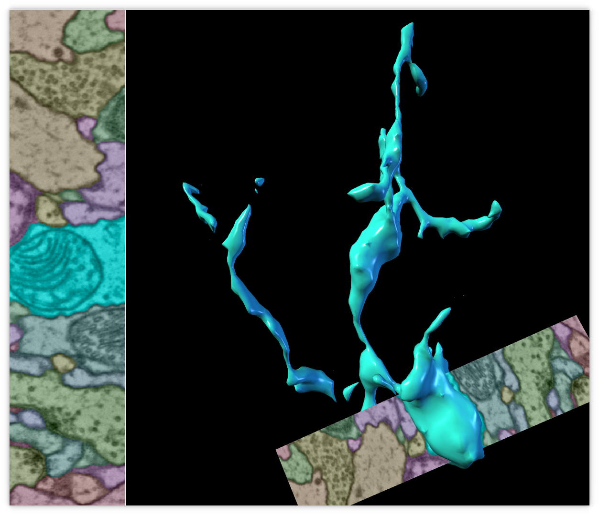
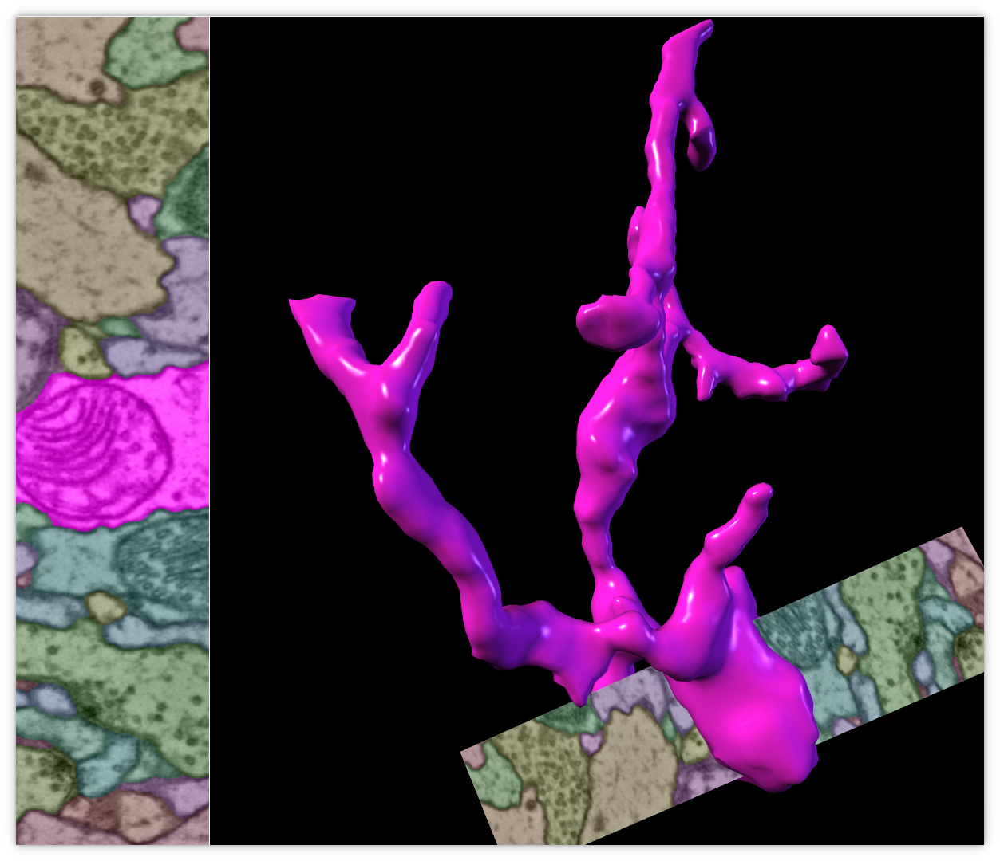
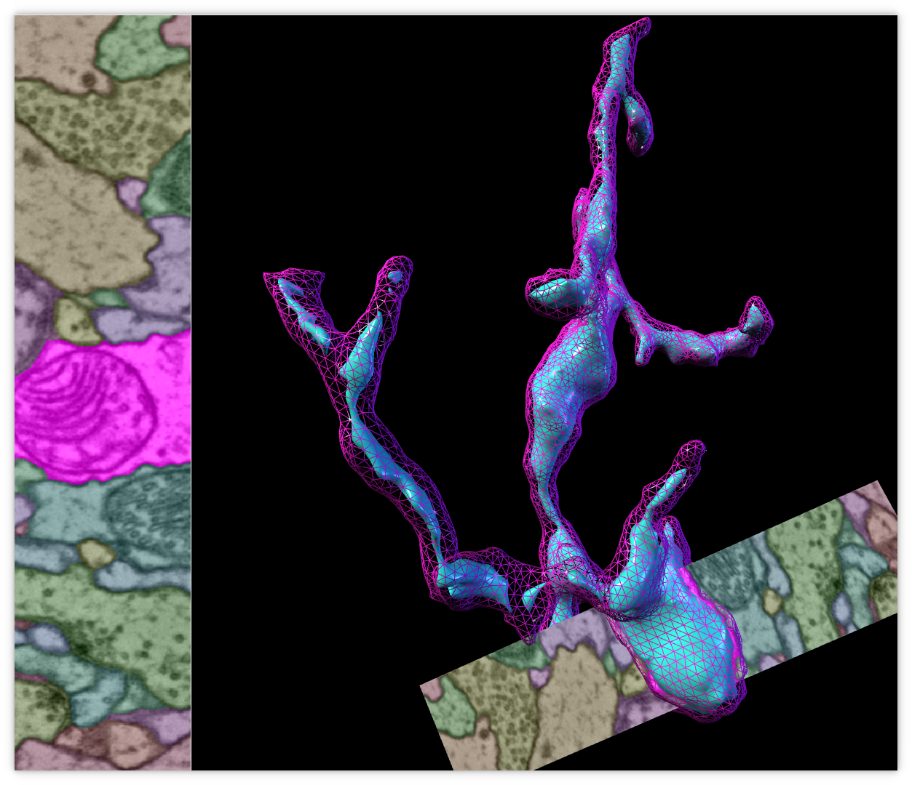

# Paintera Live Demo

[Paintera](https://github.com/saalfeldlab/paintera) is a ground-truth annotation and proof-reading tool for large-scale connectomics from 3D electron microscopy. At its core, it uses the multi-resolution renderer of [BigDataViewer](https://github.com/bigdataviewer/bigdataviewer-core) to render cross-sections through volumetric data at arbitrary orientations and zoom levels. 3D triangle-mesh representations of neurons are generated on the fly without the need for pre-computations. In particular, this means, that changes to segmentations through voxel data manipulations or super-voxel groupings are reflected immediately in the 3D visualization. Advanced painting tools allow for rapid generation of dense 3D ground truth annotations or correction of automatic segmentations. Super-voxel agglomerations can be proof-read with simple merge and detach operations triggered by mouse clicks. Paintera can be extended beyond its intended use-case via [SciJava plugins](https://github.com/scijava/scijava-common) that are auto-detected when provided as jars/class-files on the class path.

I will demonstrate the core functionality of Paintera in a live demo and will explain Paintera extension by example.

## Installation

Installation instructions are also available on the [Paintera GitHub repository](https://github.com/saalfeldlab/paintera#installation-and-usage).
Paintera depends on Java 8, JavaFX, and [Apache Maven](https://maven.apache.org). [Oracle
JDK](https://www.oracle.com/technetwork/java/javase/downloads/jdk8-downloads-2133151.html) ships
with JavaFX. Alternatively, [OpenJDK](https://openjdk.java.net/install) does not ship with JavaFX and JavaFX needs to be installed separately. Many Linux distributions provide OpenJDK 8 and JavaFX through their package managers, e.g.

```sh
# Arch Linux
pacman -S jdk8-openjdk
pacman -S java8-openjfx
pacman -S maven

# Ubuntu
apt install default-jre default-jdk
apt install openjfx
apt install maven
```

On Ubuntu 18.04, you will have to install OpenJFX 8 explicitly and then immediately pin this version:

```sh
sudo apt install openjfx=8u161-b12-1ubuntu2 libopenjfx-java=8u161-b12-1ubuntu2 libopenjfx-jni=8u161-b12-1ubuntu2
sudo apt-mark hold openjfx libopenjfx-java libopenjfx-jni
```
If your are on 18.10 or newer, add the bionic repositories following instruction on https://bugs.launchpad.net/ubuntu/+source/openjfx/+bug/1799946.

Paintera is available for installation through [conda](https://conda.io):
```sh
conda install -c conda-forge paintera
```
Or, to create a new environment for Paintera with the name *paintera*:
```sh
conda create -n paintera -c conda-forge paintera
conda activate paintera
```

Installation through conda is made possible by [jgo](https://github.com/scijava/jgo) that runs any Java main class from maven coordinates, e.g. the current Paintera snapshot (either from your local repository or from the SciJava maven repository):
```sh
$ jgo org.janelia.saalfeldlab:paintera:0.14.1-SNAPSHOT+org.slf4j:slf4j-simple:1.7.25 --version
[JavaFX Application Thread] INFO org.janelia.saalfeldlab.paintera.PainteraCommandLineArgs - Paintera version: 0.14.1-SNAPSHOT-7dca6099d77df4841f0edd569d94a5f2353e07cd
```
The `+org.slf4j:slf4j-simple:1.7.25` portion of the *endpoint* adds [slf4j logger bindings](https://www.slf4j.org) to ensure that the log is output to the command line.
Jgo is installed as a dependency of paintera or is available through the conda-forge channel:

```sh
conda install -c conda-forge jgo
```

## Supported Data
Paintera supports single and multi-channel raw data and label data from N5, HDF5, and Google Cloud storage. The preferred format is the Paintera data format but regular single or multi-scale datasets can be imported as well. Any N5-like format can be converted into the preferred Paintera format with the [Paintera Conversion Helper](https://github.com/saalfeldlab/paintera-conversion-helper) that is automatically installed with Paintera from conda. For example, to convert raw and neuron_ids of the [padded sample A](https://cremi.org/static/data/sample_A_padded_20160501.hdf) of the [CREMI](https://cremi.org) challenge, simply run:
```sh
paintera-conversion-helper \
    -r \
    -d $HOME/Downloads/sample_A_padded_20160501.hdf,volumes/labels/neuron_ids,label \
    -d $HOME/Downloads/sample_A_padded_20160501.hdf,volumes/raw,raw \
    -o $HOME/Downloads/sample_A_padded_20160501.n5 \
    -b 64,64,64 \
    -s 2,2,1 2,2,1 2,2,1 2,2,2 2,2,2 2,2,2 \
    -m -1 -1 -1 -1 5 3 2 2 2 1 \
    --label-block-lookup-backend-n5=10000
```

Paintera Conversion Helper builds on [Apache Spark](https://spark.apache.org) and can be run on any Spark Cluster, which is particularly useful for large data sets.

Pressing `ctrl-O` inside Paintera triggers a context menu for opening data.

Paintera can be extended with other data sets.

### Label Multisets





I will go through the source code if people are interested.

## 3D visualization

3D representations for label data is generated on the fly as needed and cached using imglib2-cache. Pre-computation of triangle meshes is not necessary and meshes can be updated as needed, e.g. when voxel data is modified or super-voxel agglomeration changes. Paintera data format holds a index of all containing blocks for a label for each label and is the preferred format for efficient generation of 3D representations. Plain single- or multi-scale datasets are supported but the entire dataset will have to be processed for mesh generation of each single label (slow for large data). Meshes are generated at all mipmap levels provided by the dataset and the user can select the desired level-of-detail.

## Controls & Usage

During the live-demo, I will demonstrate navigations:
 - basic controls:
   - Open preferences on the right for
     - Data set (source) specific setting
     - General settings
   - Open and remove sources
   - Cycle through sources
   - Toggle source visibility
   - Maximize current viewer
   - Save current project state
 - basic navigation (easy if you are familiar with BigDataViewer):
   - Translation (within and orthogonal toviewer plane)
   - Arbitrary rotations (also un-rotate/axis-align)
   - Zoom levels
 - Raw data
   - Single-channel
   - Multi-channel
   - Converter settings (contrast, alpha)
   - Threshold
 - Label data
   - Create empty label data set
   - Converter settings
   - Change color stream seed
   - Select (or append) label id
   - Select new, previously unused id
   - Toggle visibility of not-selected ids
   - Label voxel manipulations:
     - Painting:
       - Change brush size
       - Selected id
       - Background
       - Erase
     - Flood-filling 2D/3D
     - Shape interpolation (hot new awesome feature added by @igorpisarev)
     - Clear mesh caches
   - Super-voxel (fragment) agglomeration:
     - Merge
     - Detach/split
     - Undo
   - Not yet in UI: Rendering of synapses that intersect with selected neurons

For a cheat sheet of shortcuts, see https://github.com/saalfeldlab/paintera#usage

## Extensions

An example for Paintera extensions is provided in https://github.com/hanslovsky/paintera-opener-menu-entry. Install locally and run Paintera with the jar on the classpath to see the changes to the open dataset context menu:

```sh
git clone https://github.com/hanslovsky/paintera-opener-menu-entry
cd paintera-opener-menu-entry
mvn clean install
paintera --additional-endpoints my.group:my.artifact:0.1.0-SNAPSHOT --
```

## Acknowledgements

 - <a href="https://github.com/tpietzsch"></a> [Tobias Pietzsch](https://github.com/tpietzsch) created the foundation of Paintera with [ImgLib2](https://github.com/imglib/imglib2) and the multi-resolution renderer of [BigDataViewer](https://github.com/bigdataviewer/bigdataviewer-core).
 - <a href="https://github.com/igorpisarev"></a> [Igor Pisarev](https://github.com/igorpisarev) had major contributions to improve usability of Paintera, most recently: shape interpolation painting.
 - <a href="https://github.com/ssinhaleite"></a> [Vanessa Leite](https://github.com/ssinhaleite) contributed in the early development stages of Paintera, in particular the initial version of the marching cubes mesh generation.
 - <a href="https://github.com/neptunes5thmoon"></a> [Larissa Heinrich](https://github.com/neptunes5thmoon) created the synaptic cleft predictions used in this example.
 - <a href="https://github.com/constantinpape"></a> [Constantin Pape](https://github.com/constantinpape) created the neuron segmentation used in this example.

## Resources

 - https://github.com/saalfeldlab/paintera
 - https://github.com/saalfeldlab/paintera-conversion-helper
 - https://github.com/hanslovsky/paintera-opener-menu-entry
 - https://cremi.org/data
 - https://github.com/bigdataviewer/bigdataviewer-core
 - https://github.com/scijava/jgo
 - https://github.com/remkop/picocli
 
